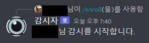
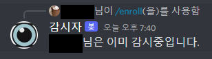
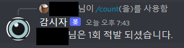
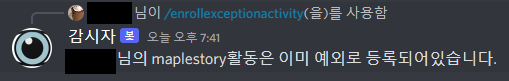
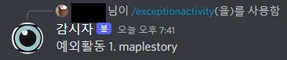
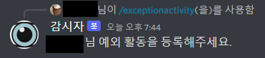
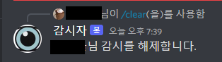
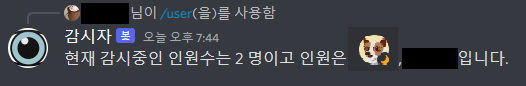
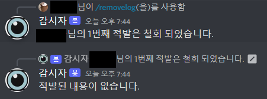
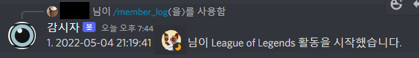

<div align="center">
  


</div>

# Observot

이 프로젝트는 사용자의 활동을 모니터링하고 로그, 예외, 사용자 데이터를 저장하기 위해 MySQL 데이터베이스를 관리하는 디스코드 봇입니다. 봇은 여러 명령어를 사용하여 사용자와 상호 작용하고 데이터를 관리합니다.

## 목차

- [기능](#기능)
- [설치](#설치)
- [환경 설정](#환경-설정)
- [사용법](#사용법)
  - [명령어](#명령어)
- [데이터베이스 스키마](#데이터베이스-스키마)
- [기여](#기여)

## 기능

- 디스코드 서버에서 사용자 활동 모니터링
- 사용자 활동을 MySQL 데이터베이스에 로그로 저장
- 예외 활동 관리
- 감시 대상 사용자 관리

## 설치

1. 이 저장소를 클론합니다.

    ```bash
    git clone <repository-url>
    cd <repository-directory>
    ```

2. 필요한 Python 패키지를 설치합니다.

    ```bash
    pip install -r requirements.txt
    ```

## 환경 설정

1. `.env` 파일을 생성하고 다음과 같이 설정합니다:

    ```plaintext
    HOST=<your-database-host>
    USER=<your-database-user>
    PASSWORD=<your-database-password>
    DB=<your-database-name>
    TOKEN=<your-discord-bot-token>
    CHEIFS=<comma-separated-chief-user-ids>
    ```

2. MySQL 데이터베이스를 설정합니다. 데이터베이스 이름을 위의 `.env` 파일에 설정한 이름으로 만듭니다.

## 사용법

디스코드 봇을 실행하려면 다음 명령어를 사용하세요:

```bash
python discordbot.py
```

봇이 활성화되면 다음 명령어를 사용하여 다양한 기능을 사용할 수 있습니다.

### 명령어

- `/EnrollExceptionActivity <activity>`: 적발 예외 활동을 등록합니다.
- `/ExceptionActivity`: 적발 예외 활동 목록을 보여줍니다.
- `/DeleteExceptionActivity <activity>`: 적발 예외 활동을 삭제합니다.
- `/Count`: 적발 횟수를 출력합니다.
- `/Log`: 적발 로그를 출력합니다.
- `/RemoveLog <name> <num>`: 적발 로그를 삭제합니다.
- `/Member_Log <name>`: 멤버<name>의 적발 로그를 출력합니다.
- `/Enroll`: 감시 대상에 등록합니다.
- `/User`: 감시 중인 사용자를 보여줍니다.
- `/Clear`: 감시 대상에서 해제합니다.

## 데이터베이스 스키마

이 프로젝트는 다음과 같은 세 개의 주요 테이블을 사용합니다:

1. `user`: 사용자 ID와 적발 횟수를 저장합니다.
2. `exception`: 사용자 ID와 예외 활동을 저장합니다.
3. `log`: 사용자 ID, 시간, 활동을 기록하여 로그로 저장합니다.

## 기여

이 프로젝트에 기여하고 싶다면, 포크를 뜬 다음 풀 리퀘스트를 보내주세요. 버그 보고나 기능 제안은 이슈 트래커를 이용해 주세요.


## 사용 예시

### 모든 멤버가 사용 가능

/enroll
<div align="left">
  
</div>
/log
<div align="left">
  
</div>
/count
<div align="left">
  
</div>
/enrollexceptionactivity
<div align="left">
  
</div>
<div align="left">
  
</div>
/exceptionactivity
<div align="left">
  
</div>
/deleteexceiptionactivity
<div align="left">
 
</div>
/clear
<div align="left">
 
</div>
/user
<div align="left">
 
</div>
### 관리자만 사용 가능
/removelog
<div align="left">
 
</div>
/member_log
<div align="left">
 
</div>

# APIs
* Dicord.py
[discord.py](https://discordpy.readthedocs.io/en/stable/api.html)
