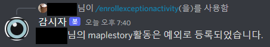

# Observot

Observot is a discord-bot.
After registering as a monitoring target, it is a Discord bot that monitors the activity status and saves and manages the activity status as a log.

# work example

## all memeber can use
* /enroll
*  
* /log
* 
* /count
* 
* /enrollexceptionactivity
*  
* /exceptionactivity
*  
* /deleteexceiptionactivity
* 
* /clear
* 
* /user
* 

## only chief can use
* /removelog
* 
* /member_log
* 

# APIs
* Dicord.py
[discord.py](https://discordpy.readthedocs.io/en/stable/api.html)
